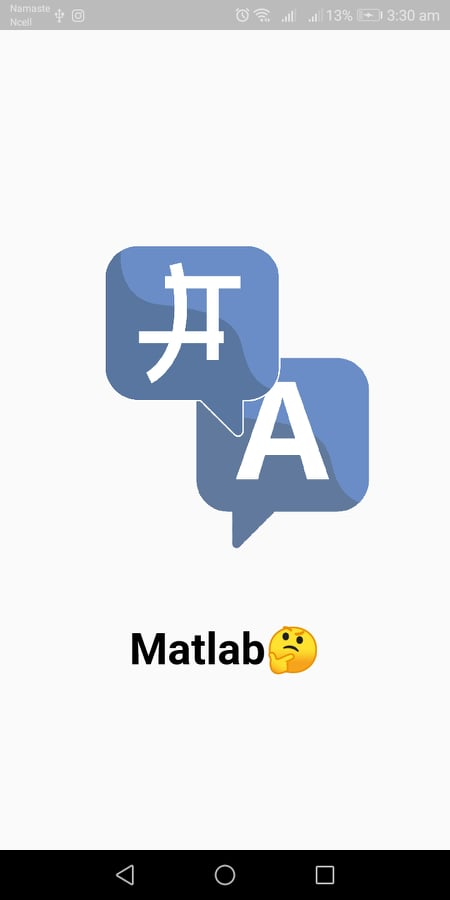
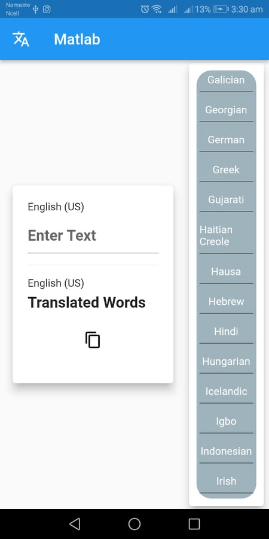
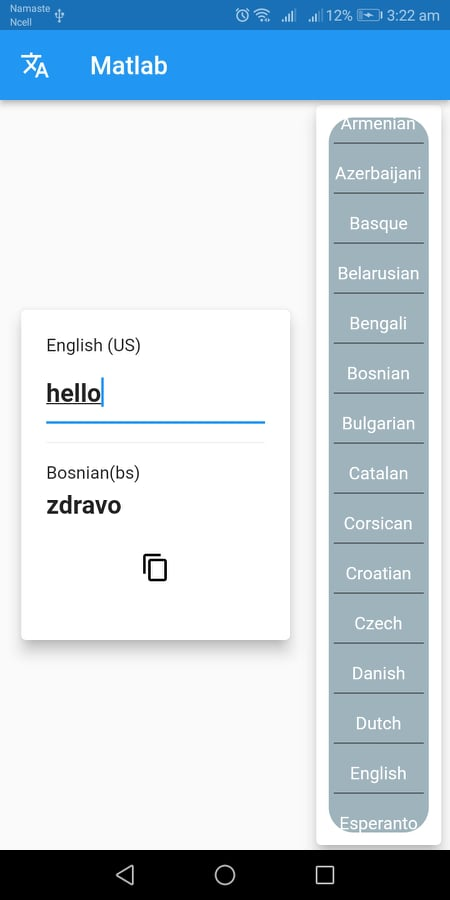
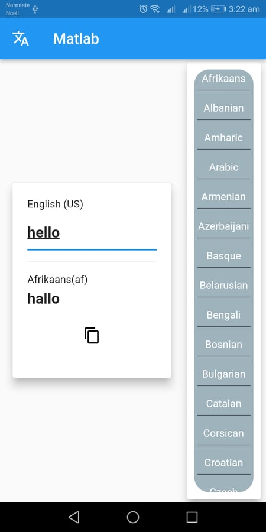
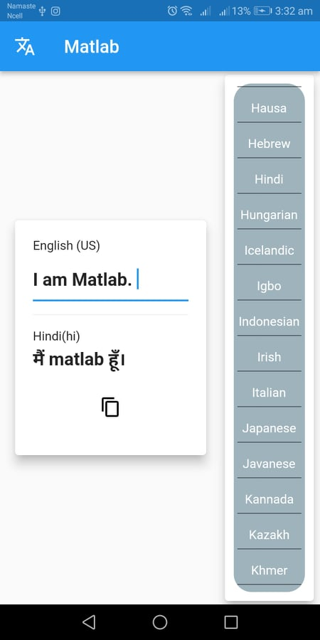

# Translator App(Matlab🤔🤔)

A Matlab App with the help of Change Notifier Provider(RiverPod)

## Getting Started

Matlab has more than a 100 languages integrated in it. Feel free to convert and Copied function has implemented in it. So "Type,Convert,Copy and Send"

## ScreenShots:

